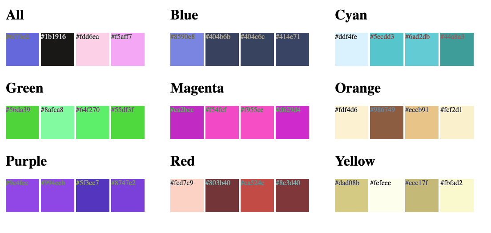

# Shades
This is a minimal golang package and app for generating random colors.
[](https://godoc.org/github.com/tpryan/shades)

## Usage

```go
shade, err := shades.NewFamily("RED")
if err != nil {
    log.Fatalf("could not get color family: %v", err)
}
color := shade.Random(1)

fmt.Printf("color: %s\n", color) // #e58677
```


If you run the sample web app you get a minimal random list of colors.




"This is not an official Google Project."
